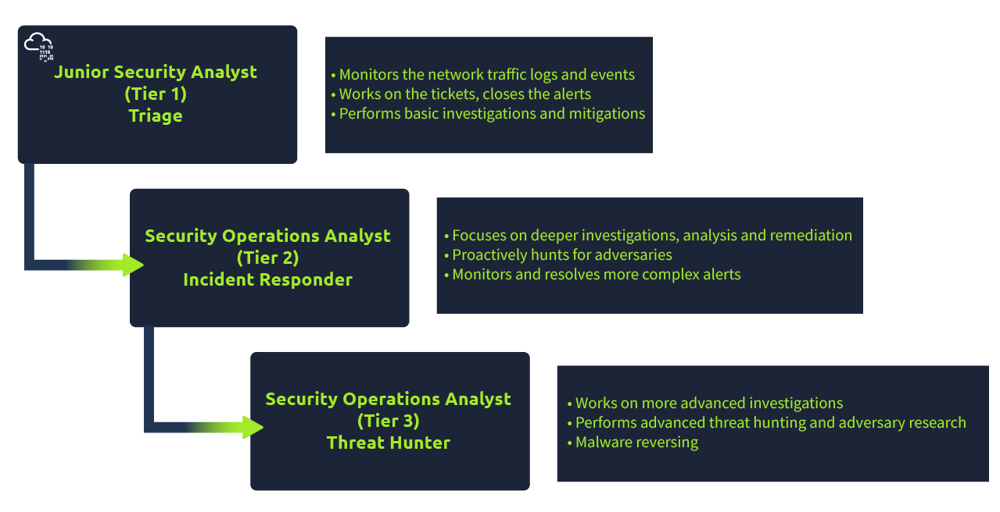
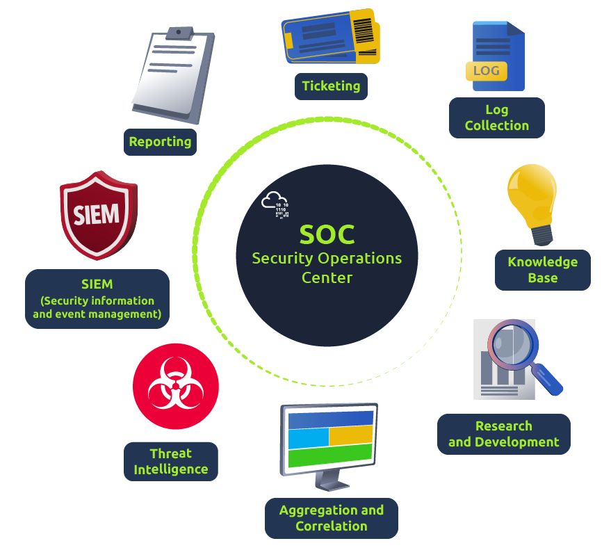

*Wie sieht eigentlich der Job eines SOC Analysten aus?*

Im Grunde beschäftigt sich ein SOC Analyst mit der Triage oder dem analysieren von Log Events und Alerts.

Die Verantwortungen eines SOC Analyst Junior liegt auf:

- Überwachen und Untersuchen von Alerts
- Konfigurieren und Verwalten von Security Tools
- Entwickeln und implementieren von IDS Signaturen
- Teilnahme an SOC Arbeoitsgruppen
- Tickts erstellen und Sicherheitsvorfälle ans Tier 2 oder die Teamleitung eskalieren

*Welche Voraussetzungen werden empfohlen?*

- 0-2 Jahre Erfahrung in Sicherheitsaufgaben
- Grundlegendes Verständnis von Netzwerken (OSI oder TCP/IP Modell bspw.), Betriebssystemen und Webanwendungen
- Skript/Programmiersprachen zu können ist ebenfalls sehr empfehlenswert

Das CompTIA Security+ Zertifikat wäre u.U. empfehlenswert

Mit steigender Erfahrung ist auch möglich ins Tier 2 oder Tier 3 zu wechseln.

*Was sind die Kernaufgaben eines SOC? (Security Operation Center)*

Im Prinzip muss ein SOC Gefahren untersuchen, überwachen, verhindern und auf diese reagieren, und das 24/7. McAfee's Definition beschreibt ein SOC folgendermaßen: Security Operation Teams sind verantwortlich für das Überwachen und Beschützen von Assets wie bspw. geistiges Eigentum, persönliche Daten, Geschäftssysteme und Firmenintigrität. Als implementierte Komponente eines allumfassendes Organisationsframework, agieren Security Operation Teams als der zentrale Punkt an dem alle gesteuerten Bemühungen zur Überwachung, Bewertungen und Abwehrung gegen Cyberattacken zusammenlaufen. 
Wieviele Mitarbeiter ein SOC hat kann je nach Unternehmungsgröße varrieren.

Vorbereiten und Verhinden

Als Junior Security Analyst solltest du immer auf dem Laufenden bleiben. Es ist entscheidend Gefahren zu erkennen und aufzuspüren, an sogenannten Roadmaps für den Schutz des Unternehmens zu arbeiten und für den Worst-Case gewappnet zu sein.

Verhinderungsmethoden beinhalten das Sammeln von Informationen der neuesten Bedrohungen, Gruppen und deren TTPs (Tactics, Techniques, Procedures). Ausserdem zählen dazu auch Wartungen wie das Updaten der Firewall Signaturen, Beheben von Schwachstellen in System, Block und Safelisting von Anwendungen, Email Adressen und IP Adressen.

Zur besseren Verständnis von TTPs kann man sich bspw. den Alarm von der APT40 (Chinesische Gruppe bzw. dauerhafte und fortschrittliche Bedrohung) der Cybersecurity & Infrastructure Agency CISA anschauen [Hier](https://us-cert.cisa.gov/ncas/alerts/aa21-200a)

