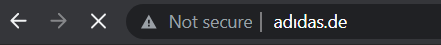
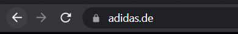

Das Konzept der Pyramid of Pain findet Verwendung in Cybersec Lösungen wie bspw. Cisco Sec, SetinelOne und SOCRadar um die Effektivität von Cyber Threat Intelligence, Threat Hunting sowie Sicherheitsvorfall Übungen zu verbessern.

Daher ist es als SOC Analyst sehr wichtig, dieses Konzept zu verstehen. 

Was befindet sich in dieser sogenannten Pyramid of Pain?

**Hash Values (Trivial)**

Microsoft definiert einen Hashwert als einen Zahlenwert einer festen Länge, welcher Daten auf eine einzigartige Art identifiziert. Der Hashwert ist das Ergebnis eines Hashing Algorythmus. Hier sind einige bekannte davon:

- MD5 (Message Digest) - Eine weit verbreitete kryptische Hashfunktion mit einem 128bit Hashwert. MD5 wird nicht als kryptisch sicher eingestuft. 
- SHA-1 (Secure Hash Algorithm 1) - wurde 1995 von der NSA entwickelt. Wenn dem SHA-1 Hashalgo Daten übergeben werden, produziert SHA-1 einen 160bit Hashwertstring als 40-stellige Hashzahl. Wird ebenfalls nicht mehr empfohlen und man sollte auf SHA-2 oder SHA-3 ausweichen. 
- SHA-2 (Secure Hash Algorithm 2) - wurde 2001 ebenfalls von der NSA enwickelt und löste SHA-1 ab. Die meistgenutzte Variante von SHA-2 ist der sogenannte SHA-256 Algorythmus. Dieser gibt einen 256-Bit Hashwert als 64-Stellige Hexzahl zurück.

Ein Hash wird nicht als kryptisch sicher gesehen, wenn zwei Dateien denselben Hashwert oder Zahlenwert haben.

Sicherheitsexperten verwenden in der Regel die Hash-Werte, um Einblicke in ein bestimmtes Malware-Beispiel, eine bösartige oder verdächtige Datei zu erhalten, und als eine Methode, um das bösartige Artefakt eindeutig zu identifizieren und zu referenzieren.

Bei Ransomware Berichten kann man häufig Hashwerte für bösartige Dateien finden. Auch Online-Tools wie VirusTotal können für die Suche von Hashwerten genutzt werden.

Wenn wir die Hashwerte solcher verdächtigen Dateien haben, ist es relativ einfach entsprechend bösartige Dateien zu finden. Wenn auch nur ein einziges Bit in einer Datei werändert wurde, wird auch der Hashwert verändert. Daher gibt es sehr viele Varianten und Instanzen, was das Threat Hunting mithilfe von Hashwerten als IOC (Indicator of Compromise) deutlich erschwert.

**IP Adresse (Easy)**

Eine IP Adresse wird zu Identifizierung von Geräten in einem Netzwerk verwendet. Diese Geräte können Computer, Server, Drucker oder auch Kameras sein. Wir nutzen IP Adressen um Informationen über Netzwerk auszutauschen. Als Teil der Pyramid of Pain schauen wir uns aber lediglich an, wie IP Adressen als Indikator genutzt werden können.

Aus unserer defensiven Perspektive kann eine IP Adresse die ein Angreifer nutzt sehr wertvoll sein. Denn wir können in unserer Firewall IP Adresse bloickieren, verweigern oder Anfragen unterbinden. Diese Methode ist allerdings nicht unfehlbar, da sich Angreifer auch einfach eine neue IP Adresse zuweisen lassen können.

Eine Möglichkeit die ein Angreifer nutzen kann um unsere Defense zu überwinden ist das nutzen von Fast Flux. 

Fast Flux ist eine DNS Technik die von Botnetze genutzt wird zum Phishing, Webproxying, Malwareverteilung sowie die kommunikativen Aktivitäten von Malware eines kompromittierten Hosts über einen gestellten Proxy. Der Zweck der Nutzung des Flux Netzwerks dient der Kommunikation zwischen der Malware und dem zugehörigen Command and Control Servers, was eine Herausforderung für Sicherheitsexperten darstellt.

Das zentrale Konzept eines Fast Flux Netzwerks sind die vielen IP Adressen die mit einem Domain Namen verbunden sind, welcher sich ständig verändert. 

**Domain Names (Simple)**

Domain Namen können als einfaches Verbinden einer IP Adresse zu einem Stück Text verstanden werden. Ein Domain Name kann eine Domain und eine Top-Level Domain enthalten (google.com) oder eine Sub-Domain, gefolgt von einer Domain und einer Top-Level Domain (api.google.com). 

Das ändern eines Domain Namens kann etwas schwieriger für einen Angreifer sein, da man diese Domains normalerweise kaufen oder regisitrieren muss und die DNS Einträge verändern muss. 

Leider haben DNS Provider sehr schlechte Standards und stellen APIs zur Verfügung, welche es einem Angreifer eifnacher macht, die Domain zu wechseln.

Fällt dir bei dem Bild irgendetwas auf? Vergleichs mal mit diesem hier:

Das Beispiel zeigt eine Punycode Attacke, die Angreifer nutzen, um einen Anwender auf eine schädliche Domain weiterzuleiten, die wie eine offizielle  Seite aussieht.

Unter Punycode versteht man das Umwandeln von Wörtern die nicht in ASCII abbildbar sind in eine Unicode ASCII kodierung.

Was du da oben siehst ist adıdas.de mit dem Punycode of http://xn--addas-o4a.de/
Internet Explorer, Google Chrome, Microsoft Edge, und Apple Safari sind sehr gut darin, die verleierten Zeichen in einen vollen Punycode Domain Namen umzuandeln.

Um diese bedrohlichen Domains zu erkennen, kann man Proxy Logs oder Server Logs nutzen.

Angreifer verstecken in der Regel ihre schädlichen Domains unter URL Shorteners. Ein URL Shortener ein Tool, das eine kurze und einzigartige URL erstellt die eine Weiterleitung zu einer speziellen Webseite ist, die beim Erstellen des URL Shortener Links angegeben wird. Hier sind einige Beispiele für URL Shortener Services die schädliche Links erstellen:

- bit.ly
- goo.gl
- ow.ly
- s.id
- smarturl.it
- tiny.pl
- tinyurl.com
- x.co

Man kann die Webseite sehen, zu der der Shortener Link hinführt indem man ein diesem ein "+" anfügt. (http://tinyurl.com/57csdf+)

**Host Artifacts (Annoying)**

